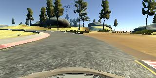
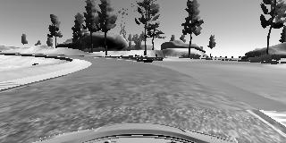
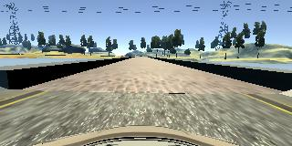
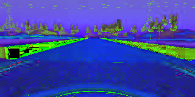
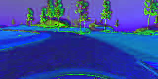
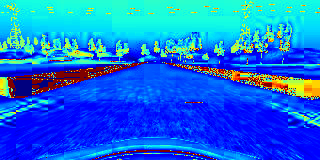
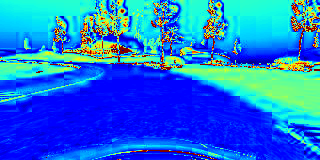
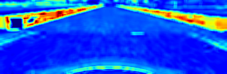
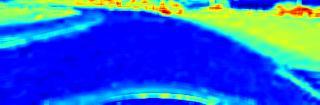

# Project: Behavioural Cloning
Teaching a car to make driving decisions on its own inside a simulator

### Project Structure
Overview of the different files submitted in the project
1. **`model.py`**: The primary python file which houses all the code to pre-process images, create the Keras model and train the model. You don't need to run this file.
2. **`aws-model-final.ipynb`**: A Jupyter notebook which houses the same code as the model.py file.
3. **`model-tiny3.h5`**: Never mind the weird name. It's the saved, trained model.
4. **`drive.py`**: A python file which connects your saved model to the car simulator.
5. **`writeup_report.md`**: A report summarizing the results etc.

To run the project, open the simulator and the command line on your computer. Type the following:
```
python drive.py model-tiny3.h5
```
Then open the simulator and turn on the *Autonomous Mode*.

### Model Architecture and Training Strategy
##### Architecture
(Input images are single-channel and resized to (25h,80w)
- 1D Convolution with a filter size of 3
- ReLU activation
- 1D MaxPooling (filter size of 2)
- Flatten
- Fully Connected Layer (64)
- Dropout with p=0.3
- Fully Connected Layer (1) -> **The final neuron**

The final model is just **754 kB** in size!

##### Attempts to reduce overfitting
I use a MaxPooling layer after the convolutional layer, as well as a dropout layer. The model is anyway very small so this much is enough.

##### Model tuning
I used an Adam optimizer and used MSE as the loss function, because it is a regression model. So the learning rate was not hard coded.

##### Training data
The training data was all collected manually, without any image augmentation. I used one set that recorded normal driving, and two other sets in which I had recorded recovery driving (starting from edges and taking the car to the center, etc). All in all it had around 11.4k images.

##### Training
I trained for just 5 epochs, with a batch size of 32. To improve efficiency of the model, the batches were generated using a generator function. I also split the training data into training/validation sets, using the sklearn library.

### Solution Design Approach
I spent around 3 weeks on this project, going from models varying between 300 MB and 750 KB in size, and using datasets with sizes ranging from 100,000 to 10,000 images. Initially I was trying to brute force the solution through "*tons of data, lots of layers*", then saned down to "*tons of preprocessed data, slightly fewer layers*" and finally "*relevant, preprocessed data, and around just enough layers*".
###### Approach 1
Used full-color, full-size 160x320x3 center-camera images, taken from Udacity data and some self-collected ones. It was a huge model of over 300 MB in size, but it did a pathetic job. The car simply drove off the track after a few seconds.

###### Approach 2
Decided that I didn't have enough data, so I took the left and right camera images and added them to the training set, with a correction of 0.22 degrees. I also resized the images to 60h, 120w so that my model could be smaller. I also added Cropping and Normalizing layers to the Keras model, with 3 convolutional layers and just 1 fully connected neuron at the end. It was much better than before, but I felt it needed more recovery data for the bridge on Track 1. I also tried to augment the data by horizontal-flipping the images.

###### Approach 3
Collected even more recovery data. Trained for 5 epochs. This model could get past the bridge but then drove off into the dirt patch on the right side, after the bridge. I naively felt I needed even more recovery data. So I recorded more. At last my model was still driving off the road, not only on the dirt patch but even before reaching the dirt batch.

###### Approach 4
I felt that my dataset had too many 0.0 angle entries. So I felt I should randomly remove around 40% of them. I did that, and my model got even worse. At this point I felt that I have enough data, but apparently my model needed more layers (!) so I added dense layers, and did a grayscale to them before passing into the model. The car still drove off the track into the bushes.

###### Approach 5
Now I thought maybe I should preprocess more. I looked at my grayscale images and decided that I need to increase the contrast somehow because my grayscale images were not showing the dirt patch clearly enough. So I used this neat technique called *histogram equalization*. The car could now get past the bridge but then gets stuck later.
This is what histogram equalization does:

**Original:**

 

**Grayscale:**

 

**Histogram Equalized:**


###### Approach 6
"Hmm, maybe I should keep the images to their full size? Who knows I might be losing valuable information!" I changed convolution layer lengths and reverted images to full size, while keeping the grayscale. Got even worse performance.

###### Approach 7
I picked up this technique called *Batch Normalization* and decided it could be the end to my woes (basically at this point I had made at least a couple dozen models using the above 6 approaches and was pretty much shooting in the dark). So I added BN, and even copied the huge network architecture which was used in that paper. The model got too big for my image data and ran into all sorts of errors.

###### Approach 8 (FINAL PIPELINE AND ARCHITECTURE)
Finally I went to the student community and requested to see their github repos etc, to get new ideas (I had almost run out of my own), and to get inspiration. I read through some Medium posts by other students, and found Mengxi Wu's post the most interesting. I learned he used HSV color transform, so I decided I'll use that next. Spent a few hours studying color theory and rethinking my approach from the fundamentals. Next I had a nice preprocessing pipeline:
* Resize to 40h, 80w
* Crop
* Convert to HSV space, and extract only the saturation channel
* Do a Gaussian blur to further simplify the image
* Normalize the values

**Original**

      

**HSV Transform**

      

**Extracted the Saturation Channel**

      

**Blurred, Normalized and Cropped**

      


I also slimmed down my model to just a few layers (one convolution, maxpool, relu, dropout and a single fully connected neuron at the end). It instantly got my car to complete the track.
And yippiee! The car completes track 1, and I can finally submit the project. It doesn't do much in Track 2, but that's a challenge for another day for now.